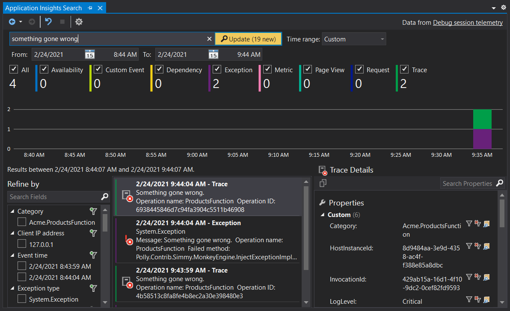

# Choas App Services

This repository is meant to share my [chaos engineering](https://en.wikipedia.org/wiki/Chaos_engineering) experiments to achieve knowledge in designing [resilient systems](https://insights.sei.cmu.edu/sei_blog/2019/11/system-resilience-what-exactly-is-it.html).

For now it's available just a Function App in which latency and fault chaos policy are injected. This App Service is based on [Simmy](https://github.com/Polly-Contrib/Simmy) in turn based on [Polly](https://github.com/App-vNext/Polly).

## Dependencies

- .NET Core 3.1 or higher

## Configure

Just edit `local.settings.json` for local execution:

```yaml
{
  "IsEncrypted": false,
  "Values": {
    "AzureWebJobsStorage": "UseDevelopmentStorage=true",
    "FUNCTIONS_WORKER_RUNTIME": "dotnet",
    "APPINSIGHTS_INSTRUMENTATIONKEY": "test_debug",
    // Latency
    "ChaosLatencySeconds": 5,
    "ChaosLatencyInjectionRate": 0.1,
    "ChaosLatencyEnabled": true,
    // Fault
    "ChaosFaultInjectionRate": 0.05,
    "ChaosFaultEnabled": true
  }
}
```

On Azure add all configuration settings present in `local.settings.json` prefixed with `Chaos`.

## Execute

### Function App

Open Visual Studio and point your web browser to [http://localhost:7071/api/ProductsFunction](http://localhost:7071/api/ProductsFunction).

The project is configured to use [Application Insights](https://docs.microsoft.com/en-us/azure/azure-monitor/app/app-insights-overview) locally:



### Console App

A sample console app is provided to demonstrate access to Application Insights using the REST API. It reads only trace events.
The submitted [KQL](https://docs.microsoft.com/en-us/azure/data-explorer/kusto/concepts/) query is:

```sql
traces | where timestamp <= ago(1h) | limit 50
```

You need to configure `appsettings.json` with your AI Application ID and API key.

```yaml
{
    "httpTimeout": 10000,
    "aiApplicationId": "{your_app_insights_app_id}",
    "aiApiKey": "{your_api_key}",
    "timesAgo": "1h"
}
```


Just create an API key and set it along with Application ID in the configuration file.
The application will write to standard output the returned JSON.

## Libraries

- [Polly](https://github.com/App-vNext/Polly)
- [Simmy](https://github.com/Polly-Contrib/Simmy)
- [CSharpx](https://github.com/gsscoder/csharpx)
- [Bogus](https://github.com/bchavez/Bogus)
